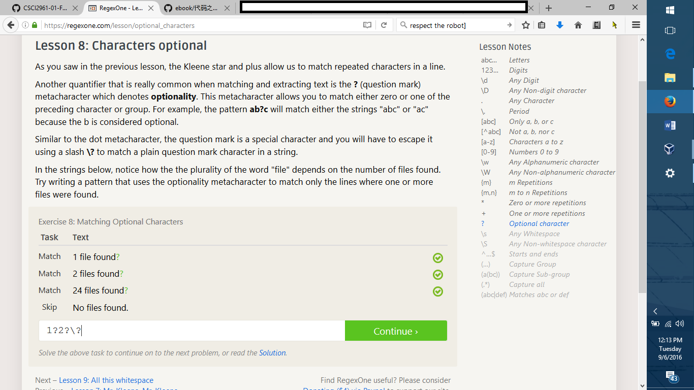

Lab1-d3 Photo: 
Lab1-e  Photo: 
Lab1-REGEX Photo: 
Lab1-Blockly Photo: 

Suggestions:
1.) Refer the person in need of help, to relative resources that have helped you in the past with regards to the issue.
2.) Contact someone you know who is more familiar with the issue, if you realize you cannot solve it on your own.
3.) Don't bother replying to repeat offenders

Thoughts on Chapter 3:
First of all, I want to know how the RIAA discovered his his search engine if it only logged all of the items on the RPI network. In any case I have always been familiar with how much archaic and deliberately greedy, the RIAA is. Even if one had the wealth and resources, the cost of having to go against the RIAA makes it a lose lose situation.

Project:
Simply enough, I have always hated how windows explorer (in details view) does not display the size of the folders.
One has to always hover their mouse over the folder, or right click and select properties to view the folder size.
This is very frustrating for a person like me, who likes to keep track of how much memory is being taken up on the drives at any given time. While there is a program that analyzes how much every file and folder takes up on the drive, I want something simpler.
So my idea is to create a project that will allow one to view the folder size on their windows explorer without having to do anything.
