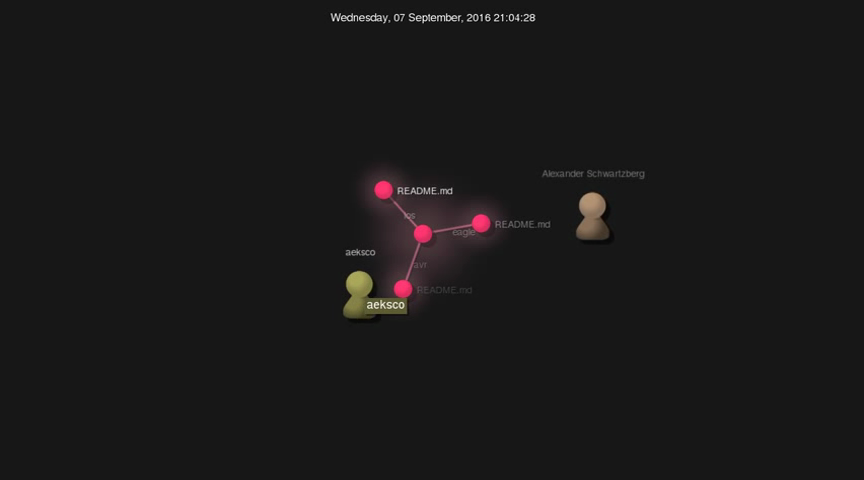
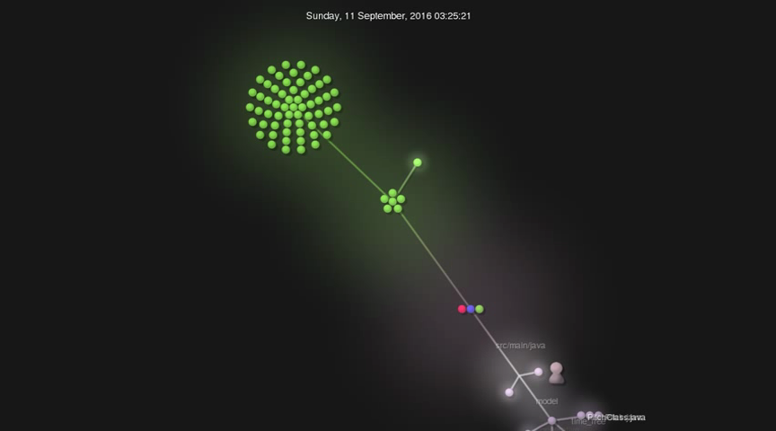
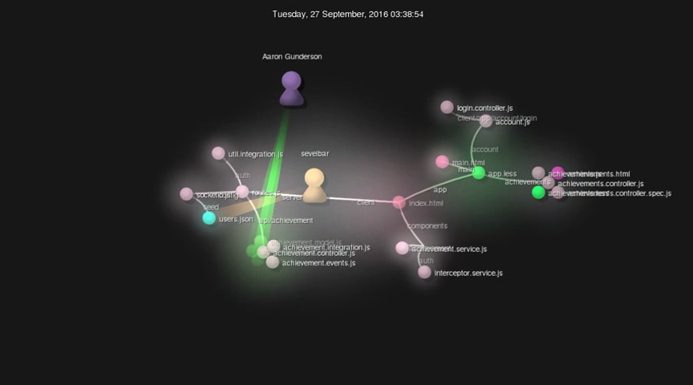
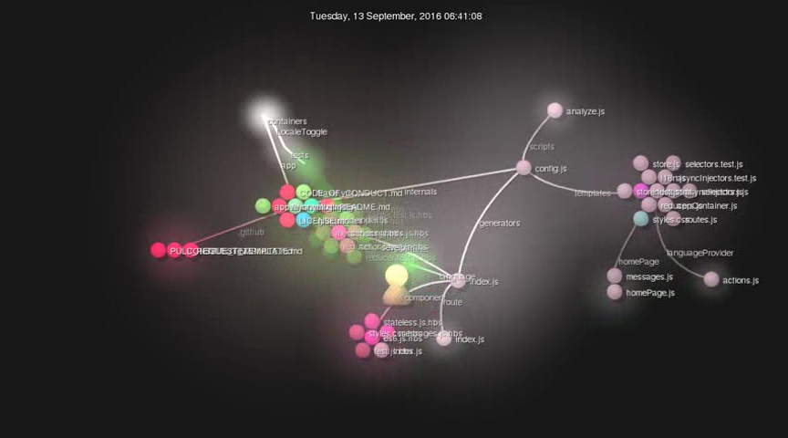
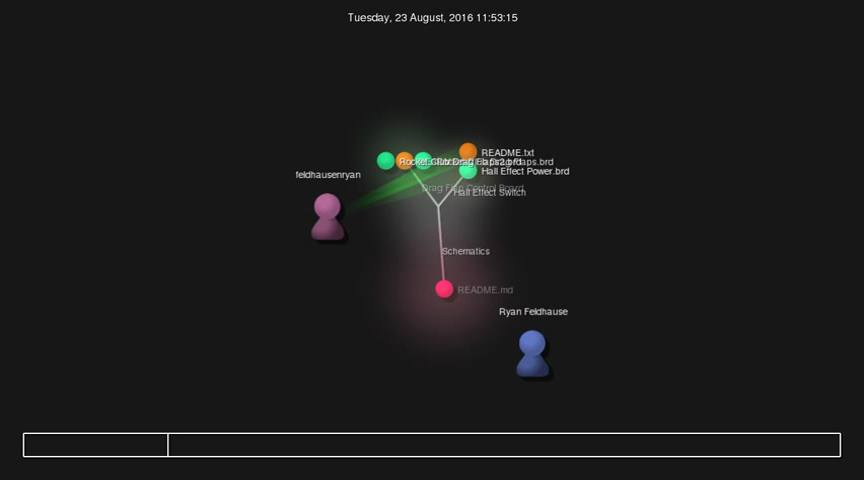

Lab Report 6:

|  Name            |  # of contributors  |  Lines of Code | First contrib  |  Second Contrib  |  The Current Branches |
|------------------|---------------------|----------------|----------------|------------------|-----------------------|
|11: Lyrebird      |  2                  |  128           |  9/7/2016      |  9/13/2016       |  7                    |
|12: Mini Zero     |  1                  |  171892        |  8/23/2016     |  10/14/2016      |  2                    |
|13: MxM           |  3                  |  3766          |  9/27/2016     |  10/8/2016       |  4                    |
|14: Observatory   |  32                 |  15020         |  8/28/2016     |  10/9/2016       |  19                   |
|15: ok-college    |  2                  |  9971          |  9/12/2016     |  10/9/2016       |  4                    |

Photos for Part3:

